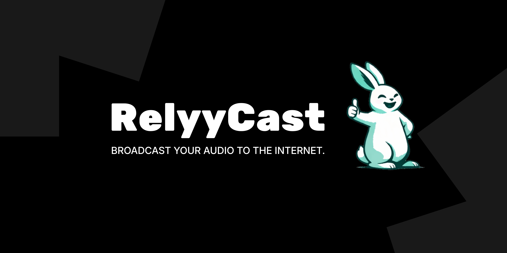

# RelyyCast



Broadcast local audio to the internet, instantly.

[](LICENSE)
[](https://relyycast.com)
[](https://relyycast.com)
[](https://relyycast.com)
[](https://relyycast.com)

Welcome to the RelyyCast repository on GitHub. Here you can find the source code for the RelyyCast desktop app, browse open issues, contribute code, and keep track of ongoing development.

RelyyCast is a free, open-source desktop application that lets you broadcast a local audio stream to the internet in seconds — no port forwarding, no static IP, and no paid streaming subscription required. It runs a local [MediaMTX](https://github.com/bluenviron/mediamtx) relay on your machine, pipes your audio through [FFmpeg](https://ffmpeg.org), and optionally punches a secure public URL through [Cloudflare Tunnel](https://developers.cloudflare.com/cloudflare-one/connections/connect-networks/). The result is a shareable HLS and MP3 stream URL that works from any machine, instantly.

We recommend following the [RelyyCast blog](https://relyycast.com/blog) to stay up to date with everything happening in the project.

## Key Features

-   **Zero-config public URL** — Cloudflare Tunnel punches a public stream URL from your machine without any router or firewall changes.
-   **HLS and MP3 output** — Listeners can tune in via HLS (`index.m3u8`) or direct MP3 stream from any browser or media player.
-   **Live listener count** — Real-time metrics pulled from the local MediaMTX API are displayed directly in the app.
-   **Consent-first Cloudflare** — The tunnel is entirely opt-in. The relay works locally without any Cloudflare account.
-   **Pluggable tunnel layer** — The architecture is intentionally open. Swap in [ngrok](https://ngrok.com), [Tailscale Funnel](https://tailscale.com/kb/1223/funnel), or any self-hosted tunnel provider.
-   **System tray** — RelyyCast minimizes to the system tray so it stays running in the background without taking up dock/taskbar space.
-   **Cross-platform** — Runs natively on macOS (Apple Silicon + Intel) and Windows 64-bit. Linux support is coming soon.
-   **Free and open source** — MIT-licensed with no telemetry and no required cloud account.

## Download

The easiest way to get RelyyCast is to download the installer for your platform from the official website:

**[relyycast.com → Download](https://relyycast.com)**

| Platform | Installer | Checksum |
|---|---|---|
| macOS (Apple Silicon + Intel universal) | [RelyyCast.pkg](https://download.relyycast.com/installers/releases/0.1.0/macos/RelyyCast.pkg) | [SHA-256](https://download.relyycast.com/installers/releases/0.1.0/macos/RelyyCast.pkg.sha256) |
| Windows 64-bit | [relyycast-setup.exe](https://download.relyycast.com/installers/releases/0.1.0/windows/relyycast-setup.exe) | [SHA-256](https://download.relyycast.com/installers/releases/0.1.0/windows/relyycast-setup.exe.sha256) |
| Linux | *(coming soon)* | — |

SHA-256 checksums are published alongside every release. Always verify the checksum before running an installer downloaded from any source other than relyycast.com.

RelyyCast also publishes an update manifest so tools and scripts can check for the latest version:

-   `https://download.relyycast.com/installers/releases/macos/latest.json`
-   `https://download.relyycast.com/installers/releases/windows/latest.json`

## Getting Started

### Prerequisites

Before launching RelyyCast for the first time you will need one external dependency on your machine:

-   [**FFmpeg**](https://ffmpeg.org/download.html): RelyyCast uses FFmpeg to capture your audio input and encode it for the relay. Install it from [ffmpeg.org](https://ffmpeg.org/download.html) or via your package manager:

    ```bash
    # macOS (Homebrew)
    brew install ffmpeg

    # Windows (winget)
    winget install --id=Gyan.FFmpeg
    ```

    After installing, verify that `ffmpeg` is available on your `PATH`:

    ```bash
    ffmpeg -version
    ```

All other runtime dependencies — [MediaMTX](https://github.com/bluenviron/mediamtx) and [cloudflared](https://developers.cloudflare.com/cloudflare-one/connections/connect-networks/downloads/) — are bundled inside the installer. You do not need to install them separately.

### Installing on macOS

1.  Download `RelyyCast.pkg` from [relyycast.com](https://relyycast.com).
2.  Double-click the `.pkg` file and follow the installer prompts.
3.  Launch **RelyyCast** from your Applications folder or Spotlight.
4.  On first launch, macOS may display a Gatekeeper prompt — click **Open** to proceed. RelyyCast is notarized by Apple.

### Installing on Windows

1.  Download `relyycast-setup.exe` from [relyycast.com](https://relyycast.com).
2.  Run the installer. Windows SmartScreen may show a prompt on first run — click **More info → Run anyway**. The installer is Authenticode-signed.
3.  Launch **RelyyCast** from the Start menu or desktop shortcut.

### First Launch

Once installed, follow the [Setup Guide](docs/public/setup-guide.md) for a complete walkthrough, including:

-   Pointing RelyyCast at your audio input device.
-   Configuring your station name and stream bitrate.
-   Connecting Cloudflare Tunnel to get a public URL (optional).
-   Verifying your stream is live and sharing the URL.

## Documentation

| Guide | Description |
|---|---|
| [Setup Guide](docs/public/setup-guide.md) | First launch, settings reference, port reference, Cloudflare setup |
| [Troubleshooting](docs/public/troubleshooting.md) | Common process errors, Cloudflare failures, credential issues |
| [Listener Troubleshooting](docs/public/consumer-troubleshooting-guide.md) | End-user guide for tuning in and diagnosing playback issues |

## Repository Structure

Each directory has a focused responsibility. Here is an annotated overview:

-   [**`src/`**](src/): Application source code — React components, runtime orchestration, hooks, and utility libraries.
    -   [**`src/runtime/`**](src/runtime/): Runtime lifecycle management. Spawns and supervises MediaMTX, FFmpeg, and cloudflared processes with exponential-backoff restart logic.
    -   [**`src/lib/`**](src/lib/): Pure library functions — station config schema, stream URL builders, relay health polling, and runtime state normalization.
    -   [**`src/hooks/`**](src/hooks/): React hooks that bridge Neutralino runtime events and relay metrics to component state.
-   [**`components/`**](components/): Top-level UI components — the main station console, control tab, settings tab, status indicators, and window chrome.
-   [**`binaries/`**](binaries/): Canonical staging location for bundled runtime binaries (MediaMTX, cloudflared). **Not committed to git** — staged at build time.
-   [**`build/`**](build/): Intermediate build output for runtime assets, produced by `npm run deps:stage`.
-   [**`scripts/`**](scripts/): Build, release, and maintenance scripts.
    -   [**`scripts/installers/`**](scripts/installers/): Platform installer builders for macOS (`.pkg` via `pkgbuild`/`productbuild`) and Windows (NSIS).
    -   [**`scripts/release/`**](scripts/release/): Version bumping, patch note generation, and Cloudflare R2 upload tooling.
-   [**`docs/public/`**](docs/public/): End-user documentation published to relyycast.com.
-   [**`docs/private/`**](docs/private/): Internal development notes, architecture plans, and agent prompts. Not published.
-   [**`public/`**](public/): Static assets served by the Vite build (logo, icons).

## Architecture Overview

RelyyCast is built on [Neutralino](https://neutralino.js.org) — a lightweight cross-platform desktop runtime that delivers a native window and OS API access without the overhead of Electron. The frontend is a [React 19](https://react.dev) + [TypeScript](https://www.typescriptlang.org) application bundled by [Vite 7](https://vite.dev) and styled with [Tailwind CSS 4](https://tailwindcss.com).

At startup the runtime orchestrator (`src/runtime/neutralino-runtime-orchestrator.ts`) spawns three managed processes: **MediaMTX** (HLS relay, listening on ports `8888` and `9997`), **FFmpeg** (audio capture and RTMP ingest on port `1935`), and an internal **MP3 helper server** (port `8177`). Each process is supervised with exponential-backoff restart logic. A fourth process, **cloudflared**, is spawned only after the user explicitly opts in via the Connect Cloudflare flow.

Stream health is polled every two seconds from the MediaMTX API and displayed as a live listener count in the UI. The app minimizes to the system tray via Neutralino's tray API so the relay can stay running in the background without occupying screen real estate.

The Cloudflare integration is intentionally isolated behind a thin adapter (`src/runtime/orchestrator/runtime-cloudflare-adapter.ts`) so the tunnel layer can be replaced without touching the relay or audio pipeline.

## Reporting Security Issues

To disclose a security issue to our team, please [submit a report via our security page at relyycast.com/security](https://relyycast.com/security).

## Support

This repository is not suitable for support. Please do not use our issue tracker for support requests — use it for verified bugs and feature requests only. Support is available through the following channels:

-   For setup help, start with the [Setup Guide](docs/public/setup-guide.md) and the [Troubleshooting Guide](docs/public/troubleshooting.md).
-   For listener-side playback issues, share the [Listener Troubleshooting Guide](docs/public/consumer-troubleshooting-guide.md) with your audience.
-   For direct support, visit [relyycast.com/support](https://relyycast.com/support).

NOTE: Support requests submitted as GitHub issues will be closed without response.

## Community

A community channel is coming soon. Watch this space or check [relyycast.com](https://relyycast.com) for announcements.

## Contributing to RelyyCast

As an open-source project, we welcome community contributions. To get started, check out our [Contributing Guide](CONTRIBUTING.md) for a quick reference of development commands and contribution conventions.

## License

RelyyCast is released under the [MIT License](LICENSE).

## Developer Setup

If you would like to build RelyyCast from source or contribute to the project, read on.

### Prerequisites

-   [Node.js 20+](https://nodejs.org): Required to install dependencies and run build scripts. We recommend using [nvm](https://github.com/nvm-sh/nvm) to manage your Node version and ensure alignment with the project.
-   [FFmpeg](https://ffmpeg.org/download.html): Required at runtime for audio capture. Must be on your `PATH`.
-   **Runtime binaries**: MediaMTX and cloudflared are bundled in the installer but are **not committed to git**. You must stage them before running in development mode. See [Canonical Runtime Dependencies](#canonical-runtime-dependencies) below.
-   **macOS build host** is required to produce a signed `.pkg`. **Windows build host** is required to produce a signed `.exe`. Cross-compilation is not supported for installer builds.

### Clone and Install

```bash
git clone https://github.com/relyycast/relyycast.git
cd relyycast
npm install
```

### Canonical Runtime Dependencies

Binary payloads are not committed to git. Stage them at the following paths before running the app:

| File | macOS | Windows |
|---|---|---|
| MediaMTX config | `binaries/mediamtx/mediamtx.yml` | same |
| MediaMTX binary | `binaries/mediamtx/mac/mediamtx` | `binaries/mediamtx/win/mediamtx.exe` |
| cloudflared binary | `binaries/cloudflared/mac/cloudflared` | `binaries/cloudflared/win/cloudflared.exe` |

If you have binaries from a previous installation, use the seed script to populate them:

```bash
npm run deps:seed        # seed binaries/ from legacy locations
npm run deps:preflight   # verify all required binaries are present
npm run deps:stage       # copy binaries into build/
```

### Running in Development Mode

```bash
# macOS and Windows
npm run neutralino:run
```

For UI-only iteration without the Neutralino runtime:

```bash
npm run dev   # Vite dev server on localhost:3000
```

### Common Commands

| Command | Description |
|---|---|
| `npm run dev` | Vite dev server (UI only, no Neutralino) |
| `npm run neutralino:run` | Full desktop app in development mode |
| `npm run build` | Build Vite assets and stage runtime dependencies |
| `npm run neutralino:build` | Package the Neutralino app |
| `npm run installer:build` | Build the signed platform installer (`.pkg` / `.exe`) |
| `npm run release:upload:r2` | Upload the release artifact and update `latest.json` |
| `npm run deps:preflight` | Verify all runtime binaries are present |
| `npm run deps:seed` | Seed `binaries/` from legacy locations |
| `npm run deps:stage` | Stage binaries into `build/` |
| `npm run ffmpeg:detect` | Check whether FFmpeg is available on the host `PATH` |
| `npm run lint` | Run ESLint |
| `npm run version:bump:decimal` | Bump the patch version (`x.y.z → x.y.(z+1)`) |

### Release Flow

```bash
npm run version:bump:decimal    # bump version in package.json
npm run installer:build         # build signed installer for the current platform
npm run release:upload:r2       # upload installer + sha256 + manifest to Cloudflare R2
```

### Code Signing

#### macOS

`npm run installer:build` on macOS runs `build-pkg.sh`, which calls `pkgbuild`, `productbuild`, `codesign`, and `notarytool`. Set the following environment variables (or add them to `.env.release.local`):

```bash
APPLE_SIGN_APP=true
APPLE_SIGN_PKG=true
APPLE_DEVELOPER_ID_APP=Developer ID Application: Your Name (TEAMID)
APPLE_DEVELOPER_ID_PKG=Developer ID Installer: Your Name (TEAMID)
APPLE_NOTARIZE=true
APPLE_TEAM_ID=XXXXXXXXXX
APPLE_NOTARIZE_APPLE_ID=you@example.com
APPLE_NOTARIZE_APP_PASSWORD=xxxx-xxxx-xxxx-xxxx
```

#### Windows

`npm run installer:build` on Windows runs the NSIS build flow with optional Authenticode signing. Set one of these identity modes:

```bash
# Mode A: PFX file
WINDOWS_SIGN_CERT_FILE=C:\path\to\cert.pfx
WINDOWS_SIGN_CERT_PASSWORD=your_pfx_password

# Mode B: Windows cert store subject name
WINDOWS_SIGN_SUBJECT_NAME=Your Company Name
```

Use `npm run installer:build:skip-sign` to produce an unsigned installer for local testing.

### R2 Upload Configuration

The release upload script pushes the installer, a `.sha256` checksum, a versioned `manifest.json`, and an updated `latest.json` to Cloudflare R2. Set the following variables (or add them to `.env.release.local`):

```
S3_ENDPOINT=
S3_BUCKET=
S3_KEY=
S3_SECRET=
S3_PREFIX=        # optional key prefix
S3_REGION=        # optional, defaults to auto
S3_PUBLIC_URL=    # public base URL for generated download links
```
